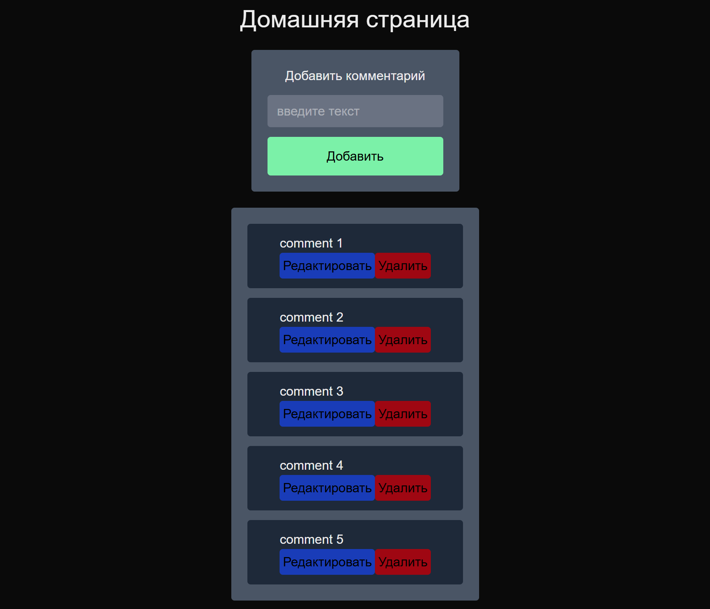

# Next.js Route Handlers Demo

Проект демонстрирует работу с Route Handlers в Next.js для создания CRUD API комментариев.

_Интерфейс_

## Технологии

- Next.js 16.0.4
- React 19.2.0
- TypeScript
- Tailwind CSS

## Особенности реализации

### 1. Маршрутизация API

**Статические Route handlers** (`src/app/comments/route.ts`):

- `GET /comments` - получение всех комментариев
- `POST /comments` - создание нового комментария

**Динамические Route handlers** (`src/app/comments/[id]/route.ts`):

- `GET /comments/:id` - получение конкретного комментария
- `PATCH /comments/:id` - обновление комментария
- `DELETE /comments/:id` - удаление комментария

**Query parameters** (`src/app/users/api/route.ts`):

- `GET /users` - получение всех пользователей
- `GET /users/api?query=${search}&limit=${limit}` - передача 2-х query параметров

**headers** (`src/app/profile/api/route.ts`):

- `GET /profile/api` - работа с headers

### 2. Клиентская часть

Главная страница (`src/app/page.tsx`) содержит:

- Рендеринг всего списка комментариев с возможностью редактирования и удаления
- Форму добавления новых комментариев
- Автоматическое обновление списка после изменений
- Link для перехода на /user

### 3. Интеграция с внешним API

Проект использует MockAPI сервер для хранения данных и jsonplaceholder для получения моковых данных
